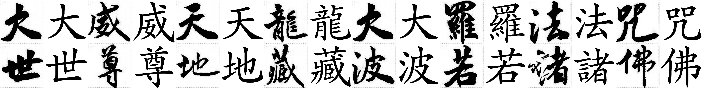
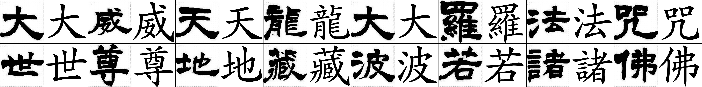
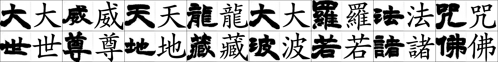
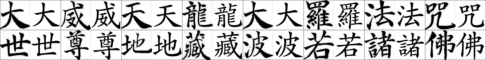

# zi2zi: Master Chinese Calligraphy with Conditional Adversarial Networks

A zi2zi pytorch implement based on [zi2zi-pytorch](https://github.com/xuan-li/zi2zi-pytorch). Fix some bugs so it can have the same network and performance as the [zi2zi](https://github.com/kaonashi-tyc/zi2zi). Also, integrate some improvement from [Font2font](https://github.com/jasonlo0509/Font2Font).




新楷体——行書-王壯為

"**諸**" is not very good.




新楷体——隸書-何紹基




新楷体——隸書-趙之謙




新楷体——美工-瘦顏體

## How to Use
### Step Zero
Download tons of fonts as you please
### Requirement

We use the environment below:

* Python 3.7
* CUDA 10.2
* cudnn 7.6.5
* pytorch 1.5.1
* pillow 7.1.2
* numpy 1.18.1
* scipy 1.4.1
* imageio 2.8.0

### Preprocess
To avoid IO bottleneck, preprocessing is necessary to pickle your data into binary and persist in memory during training.

#### Font2Font

First run the below command to get the font images:

```sh
python font2img.py --src_font=src.ttf
                   --dst_font=trg.otf
                   --charset=CN
                   --sample_count=1000
                   --sample_dir=dir
                   --label=0
                   --filter
                   --shuffle
                   --mode=font2font
```
Four default charsets are offered: CN, CN_T(traditional), JP, KR. You can also point it to a one line file, it will generate the images of the characters in it. Note, **filter** option is highly recommended, it will pre sample some characters and filter all the images that have the same hash, usually indicating that character is missing. **label** indicating index in the category embeddings that this font associated with, default to 0.

**Suggestion**: Use the same source font, and different target font will give you better performance.

**Demo**: For example, you have a.ttf, b.ttf, c.ttf, d.ttf. And you want to use a.ttf as source font. First, you should give b.ttf ~ d.ttf each one an ID.

| b.ttf | c.ttf | d.ttf |
| ----- | ----- | ----- |
| 0     | 1     | 2     |

Then you should run font2img.py three times.

```sh
python font2img.py --src_font=a.ttf
                   --dst_font=b.ttf
                   --charset=CN
                   --sample_count=1000
                   --sample_dir=dir
                   --label=0
                   --filter
                   --shuffle
                   --mode=font2font
```


```sh
python font2img.py --src_font=a.ttf
                   --dst_font=c.ttf
                   --charset=CN
                   --sample_count=1000
                   --sample_dir=dir
                   --label=1
                   --filter
                   --shuffle
                   --mode=font2font
```


```sh
python font2img.py --src_font=a.ttf
                   --dst_font=d.ttf
                   --charset=CN
                   --sample_count=1000
                   --sample_dir=dir
                   --label=2
                   --filter
                   --shuffle
                   --mode=font2font
```

Watch out the **--label** is different.

If you want validate the network with specific text, run the below command. 

```sh
python font2img.py --src_font=src.ttf
                   --dst_font=trg.otf
                   --charset=valid.txt
                   --sample_count=len(infer.txt)
                   --sample_dir=dir
                   --label=0
                   --mode=font2font
```

**valid.txt** should be a one line file. 

#### Font2Imgs

```sh
python font2img.py --src_font=src.ttf
                   --dst_imgs=target_path
                   --sample_count=1000
                   --sample_dir=dir
                   --mode=font2imgs
```

Refer to `font2imgs` function (**font2img.py**, line 114) for more details. Also you should change some codes or regular expressions before your own experiments.

#### Imgs2Imgs

```sh
python font2img.py --src_imgs=source_path
                   --dst_imgs=target_path
                   --sample_count=1000
                   --sample_dir=dir
                   --mode=imgs2imgs
```

Refer to `imgs2imgs` function (**font2img.py**, line 146) for more details. Also you should change some codes or regular expressions before your own experiments.

### Package

After obtaining all images, run **package.py** to pickle the images and their corresponding labels into binary format:

```sh
python package.py --dir=image_directories
                  --save_dir=binary_save_directory
                  --split_ratio=[0,1]
```

After running this, you will find two objects **train.obj** and **val.obj** under the **--save_dir** for training and validation, respectively.

If you want infer/validate the network with specific text, run the below command. 

```sh
python package.py --dir=image_directories
                  --save_dir=binary_save_directory
                  --split_ratio=0
```

Watch out that **--split_ratio=0**, so **val.obj** is an empty file. Maybe you can rename **train.obj** into **infer.obj** or **val.obj** somehow.

### Experiment Layout
```sh
experiment/
└── data
    ├── train.obj
    └── val.obj
```
Create a **experiment** directory under the root of the project, and a data directory within it to place the two binaries. Assuming a directory layout enforce better data isolation, especially if you have multiple experiments running.
### Train
To start training run the following command

```sh
python train.py --experiment_dir=experiment 
				--gpu_ids=cuda:0 
                --batch_size=32 
                --epoch=100
                --sample_steps=200 
                --checkpoint_steps=500
```
**schedule** here means in between how many epochs, the learning rate will decay by half. The train command will create **sample,logs,checkpoint** directory under **experiment_dir** if non-existed, where you can check and manage the progress of your training.

During the training, you will find two or several checkpoint files **N_net_G.pth** and **N_net_D.pth** , in which N means steps, in the checkpoint directory.

**WARNING**, If your **--checkpoint_steps** is small, you will find tons of checkpoint files in you checkpoint path and your disk space will be filled with useless checkpoint file. You can delete useless checkpoint to save your disk space.

### Infer
After training is done, run the below command to infer test data:

```sh
python infer.py --experiment_dir experiment
                --batch_size 32
                --gpu_ids cuda:0 
                --resume {the saved model you select}
                --obj_pth obj_path
```

For example, if you want use the model **100_net_G.pth** and **100_net_D.pth** , which trained with 100 steps, you should use **--resume=100**. 

However, if you want to infer on some your own text and **DON'T want to generate pickle object file**,  use the command below:

```sh
python infer.py --experiment_dir experiment
                --gpu_ids cuda:0
                --batch_size 32
                --resume {the saved model you select}
                --from_txt
                --src_font {your model\'s source font file}
                --src_txt 大威天龙大罗法咒世尊地藏波若诸佛
                --label 3
```

**src_txt** is the raw text you want to infer. **label** is the type of target character you want.

In our pre-trained model, the mapping relationships between **label** and writers are below:

```python
writer_dict = {
        '智永': 0, ' 隸書-趙之謙': 1, '張即之': 2, '張猛龍碑': 3, '柳公權': 4, '標楷體-手寫': 5, '歐陽詢-九成宮': 6,
        '歐陽詢-皇甫誕': 7, '沈尹默': 8, '美工-崩雲體': 9, '美工-瘦顏體': 10, '虞世南': 11, '行書-傅山': 12, '行書-王壯為': 13,
        '行書-王鐸': 14, '行書-米芾': 15, '行書-趙孟頫': 16, '行書-鄭板橋': 17, '行書-集字聖教序': 18, '褚遂良': 19, '趙之謙': 20,
        '趙孟頫三門記體': 21, '隸書-伊秉綬': 22, '隸書-何紹基': 23, '隸書-鄧石如': 24, '隸書-金農': 25,  '顏真卿-顏勤禮碑': 26,
        '顏真卿多寶塔體': 27, '魏碑': 28
    }
```

If you are professional at ancient Chinese handwriting and want to analysis these AI writings by each writer, so you want to generate every type of writing......

Not at all, we prepare the command below for your crazy idea!

```sh
python infer.py --experiment_dir experiment
                --gpu_ids cuda:0
                --batch_size 32
                --resume {the saved model you select}
                --from_txt
                --src_font {your model\'s source font file}
                --src_txt 大威天龙大罗法咒世尊地藏波若诸佛
                --run_all_label
```

This command will output every type of writing in you infer path. Have fun!

## Pre-trained model

For some our school's own reasons, we can't release pre-trained model now.

We will release our model as soon as possible.

## Acknowledgements
Code derived and rehashed from:

* [pix2pix-tensorflow](https://github.com/yenchenlin/pix2pix-tensorflow) by [yenchenlin](https://github.com/yenchenlin)
* [Domain Transfer Network](https://github.com/yunjey/domain-transfer-network) by [yunjey](https://github.com/yunjey)
* [ac-gan](https://github.com/buriburisuri/ac-gan) by [buriburisuri](https://github.com/buriburisuri)
* [dc-gan](https://github.com/carpedm20/DCGAN-tensorflow) by [carpedm20](https://github.com/carpedm20)
* [origianl pix2pix torch code](https://github.com/phillipi/pix2pix) by [phillipi](https://github.com/phillipi)
* [zi2zi](https://github.com/kaonashi-tyc/zi2zi) by [kaonashi-tyc](https://github.com/kaonashi-tyc)
* [zi2zi-pytorch](https://github.com/xuan-li/zi2zi-pytorch) by [xuan-li](https://github.com/xuan-li)
* [Font2Font](https://github.com/jasonlo0509/Font2Font) by [jasonlo0509](https://github.com/jasonlo0509)

## License
Apache 2.0

